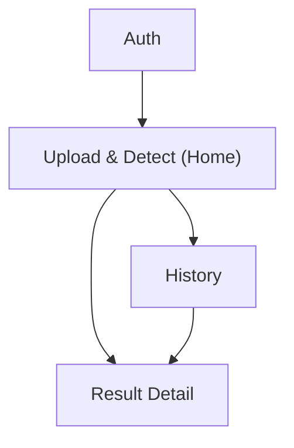

## 1. Product Overview
A web app that lets you upload plant photos, detects likely disease via Roboflow inference, and stores structured results in Supabase.
It helps you quickly identify issues and track diagnosis history over time.

## 2. Core Features

### 2.1 User Roles
| Role | Registration Method | Core Permissions |
|------|---------------------|------------------|
| User | Email + password (Supabase Auth) | Upload images, run detection, view own results history |

### 2.2 Feature Module
Our app requirements consist of the following main pages:
1. **Auth**: sign up, sign in, sign out.
2. **Upload & Detect (Home)**: image upload, run inference, run decision logic, save result.
3. **Result Detail**: view one diagnosis result with model output and final decision.
4. **History**: browse past diagnoses, open a saved result.
5. **Admin (Optional, later)**: manage decision rules and thresholds.

### 2.3 Page Details
| Page Name | Module Name | Feature description |
|-----------|-------------|---------------------|
| Auth | Sign up / Sign in | Create account and authenticate via email + password; show validation and error states |
| Auth | Session control | Persist session; allow sign out |
| Upload & Detect (Home) | Image upload | Select/drag-and-drop an image; preview; block unsupported file types; allow reset |
| Upload & Detect (Home) | Run inference | Send image to Roboflow inference endpoint (via backend proxy) and receive raw predictions |
| Upload & Detect (Home) | Decision logic | Convert raw predictions into a final diagnosis label + confidence using deterministic rules |
| Upload & Detect (Home) | Save diagnosis | Store image and diagnosis record to Supabase; show success/failure and generated result link |
| Result Detail | Result viewer | Display final diagnosis, confidence, timestamp, and image |
| Result Detail | Model output | Display key Roboflow predictions (top classes + scores) from stored raw output |
| History | Result list | List your past diagnoses (thumbnail, label, date); support basic sorting (newest first) |
| History | Open result | Navigate to Result Detail for a selected diagnosis |

## 3. Core Process
**User flow**
1. You sign up or sign in.
2. You upload a plant image on the Home page.
3. The app sends the image to Roboflow inference (securely via a proxy endpoint).
4. The app runs decision logic to produce a final diagnosis label and confidence.
5. The app stores the image + result record in Supabase.
6. You view the result immediately, or later via History.

Key integration notes
- Roboflow model IDs: `insect-pesticide/1` and `fertilizer-sprinkling/2`.
- Inference is called server-side (backend proxy) so the Roboflow API key is never exposed to the browser.
- Images and diagnosis records are stored in Supabase (Storage + Postgres) and scoped per-user.

