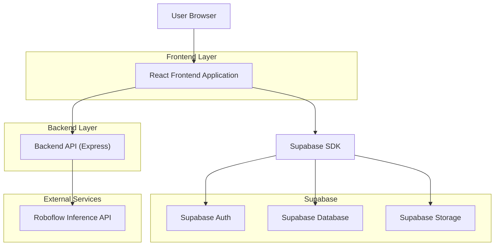
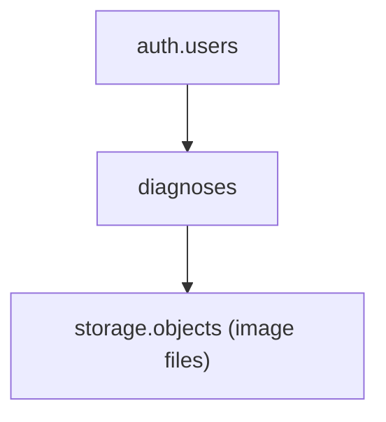

## 1.Architecture design


## 2.Technology Description
- Frontend: React@18 + TypeScript + vite + (optional) tailwindcss@3
- Backend: Node.js + Express (API proxy + decision logic)
- Data/Auth: Supabase (Auth + Database + Storage)

## 3.Route definitions
| Route | Purpose |
|-------|---------|
| /auth | Sign in / sign up |
| / | Upload image, run detection, save result |
| /results/:id | View one saved diagnosis |
| /history | View your saved diagnoses |

## 4.API definitions (If it includes backend services)
### 4.1 Inference proxy (Edge Function)
```
POST /functions/v1/roboflow-infer
```

How it accesses Roboflow:
- The Edge Function holds the Roboflow API key as a server-side secret (never shipped to the browser).
- The function forwards the uploaded image to Roboflow Hosted Inference over HTTPS and returns the raw payload.

Roboflow endpoint pattern (Hosted Inference API):
```
POST https://detect.roboflow.com/{model_slug}/{version}?api_key=ROBOFLOW_API_KEY
```

Recommended Edge Function environment variables:
- ROBOFLOW_API_KEY
- ROBOFLOW_MODEL_DISEASE_SLUG
- ROBOFLOW_MODEL_DISEASE_VERSION
- ROBOFLOW_MODEL_NUTRIENT_SLUG
- ROBOFLOW_MODEL_NUTRIENT_VERSION

Example (Supabase Edge Function in Deno) calling Roboflow:
```ts
// deno-lint-ignore-file no-explicit-any
import { serve } from "https://deno.land/std@0.224.0/http/server.ts";

serve(async (req) => {
  if (req.method !== "POST") return new Response("Method Not Allowed", { status: 405 });

  const url = new URL(req.url);
  const modelKey = url.searchParams.get("model") ?? "disease";

  const apiKey = Deno.env.get("ROBOFLOW_API_KEY");
  if (!apiKey) return new Response("Missing ROBOFLOW_API_KEY", { status: 500 });

  const modelSlug =
    modelKey === "nutrient"
      ? Deno.env.get("ROBOFLOW_MODEL_NUTRIENT_SLUG")
      : Deno.env.get("ROBOFLOW_MODEL_DISEASE_SLUG");
  const modelVersion =
    modelKey === "nutrient"
      ? Deno.env.get("ROBOFLOW_MODEL_NUTRIENT_VERSION")
      : Deno.env.get("ROBOFLOW_MODEL_DISEASE_VERSION");

  if (!modelSlug || !modelVersion) {
    return new Response("Missing Roboflow model env vars", { status: 500 });
  }

  const form = await req.formData();
  const image = form.get("image");
  if (!(image instanceof File)) return new Response("Missing image", { status: 400 });

  const rfUrl = `https://detect.roboflow.com/${modelSlug}/${modelVersion}?api_key=${encodeURIComponent(apiKey)}`;
  const rfBody = new FormData();
  rfBody.set("file", image, image.name);

  const rfRes = await fetch(rfUrl, {
    method: "POST",
    body: rfBody,
  });

  const text = await rfRes.text();
  if (!rfRes.ok) {
    return new Response(text, { status: 502, headers: { "content-type": "text/plain" } });
  }

  return new Response(text, {
    status: 200,
    headers: {
      "content-type": "application/json",
      "cache-control": "no-store",
    },
  });
});
```
Request (multipart/form-data):
| Param Name | Param Type | isRequired | Description |
|-----------|------------|------------|-------------|
| image | File | true | Plant image to infer |

Response:
| Param Name | Param Type | Description |
|-----------|------------|-------------|
| raw | object | Roboflow raw inference payload |

Shared TypeScript types (frontend-side):
```ts
export type RoboflowPrediction = {
  class: string;
  confidence: number;
};

export type RoboflowRawResponse = {
  predictions: RoboflowPrediction[];
  [k: string]: unknown;
};

export type DiagnosisDecision = {
  label: string;        // final label produced by decision logic
  confidence: number;   // final confidence (0..1)
  ruleVersion: string;  // for future reproducibility
};

export type DiagnosisRecord = {
  id: string;
  user_id: string;
  image_path: string;
  raw_inference: RoboflowRawResponse;
  decision: DiagnosisDecision;
  created_at: string;
};
```

## 6.Data model(if applicable)
### 6.1 Data model definition

Entities (logical relationships):
- diagnoses
  - id (uuid)
  - user_id (uuid, logical FK to auth.users.id)
  - image_path (text, path in Supabase Storage)
  - raw_inference (jsonb)
  - decision_label (text)
  - decision_confidence (float)
  - decision_rule_version (text)
  - created_at (timestamptz)

### 6.2 Data Definition Language
Diagnoses Table (diagnoses)
```sql
-- create table
CREATE TABLE diagnoses (
  id UUID PRIMARY KEY DEFAULT gen_random_uuid(),
  user_id UUID NOT NULL,
  image_path TEXT NOT NULL,
  raw_inference JSONB NOT NULL,
  decision_label TEXT NOT NULL,
  decision_confidence DOUBLE PRECISION NOT NULL,
  decision_rule_version TEXT NOT NULL,
  created_at TIMESTAMPTZ NOT NULL DEFAULT NOW()
);

-- create index
CREATE INDEX idx_diagnoses_user_created_at ON diagnoses(user_id, created_at DESC);

-- basic grants (typical early-stage defaults)
GRANT SELECT ON diagnoses TO anon;
GRANT ALL PRIVILEGES ON diagnoses TO authenticated;
```
