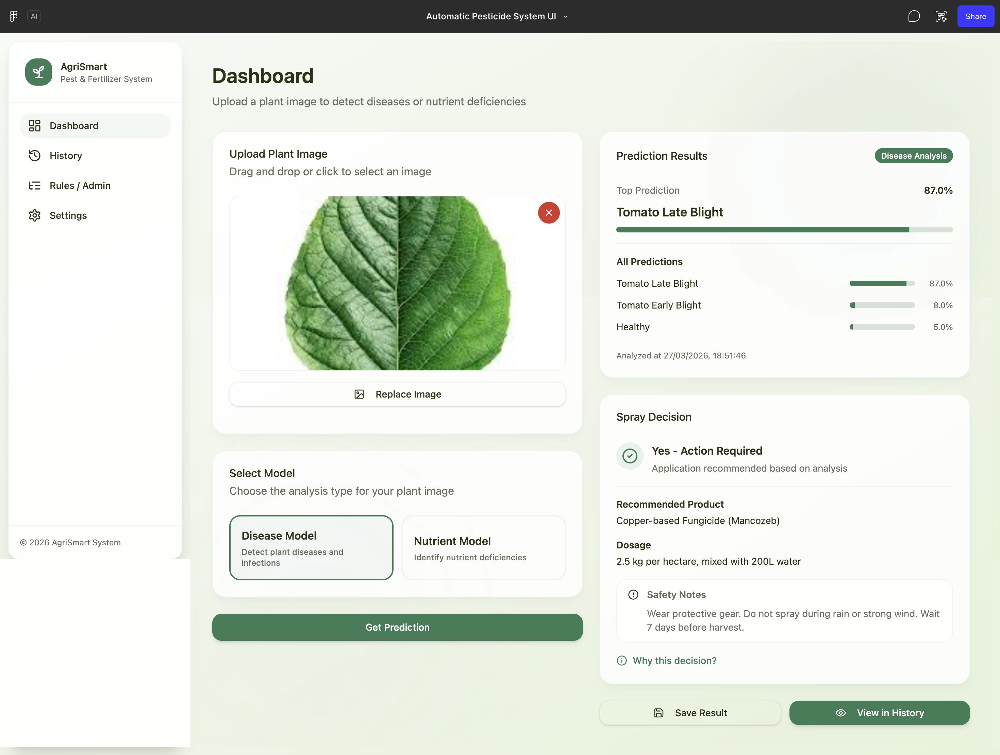

# 🌿 AgriSmart — AI-Powered Plant Disease Detection & Management System

> An intelligent, end-to-end agricultural platform that detects crop diseases using deep learning, generates treatment recommendations, schedules pesticide sprays, and simulates IoT sprinkler control — all within a single, modern Progressive Web Application.



---

## 📋 Table of Contents

- [Overview](#-overview)
- [Features](#-features)
- [System Architecture](#-system-architecture)
- [Tech Stack](#-tech-stack)
- [AI Models](#-ai-models)
- [Project Structure](#-project-structure)
- [Prerequisites](#-prerequisites)
- [Installation & Setup](#-installation--setup)
  - [1. Clone the Repository](#1-clone-the-repository)
  - [2. Install Node.js Dependencies](#2-install-nodejs-dependencies)
  - [3. Configure Environment Variables](#3-configure-environment-variables)
  - [4. Set Up Supabase](#4-set-up-supabase)
  - [5. Set Up the ML Inference Server](#5-set-up-the-ml-inference-server)
  - [6. Run the Full Application](#6-run-the-full-application)
- [Running the ML Training Pipeline](#-running-the-ml-training-pipeline)
- [Database Schema](#-database-schema)
- [API Reference](#-api-reference)
- [HuggingFace Models](#-huggingface-models)
- [Environment Variables Reference](#-environment-variables-reference)
- [Known Issues & Limitations](#-known-issues--limitations)
- [Contributors](#-contributors)

---

## 🌾 Overview

AgriSmart is a **B.Tech product-based project** that bridges the gap between cutting-edge deep learning research and practical agricultural software. It enables farmers and field agents to:

1. **Upload a crop leaf photo** and instantly receive an AI-powered disease diagnosis
2. **Get a specific treatment recommendation** (chemical name, dosage, application schedule)
3. **Track plant health** over time with a full diagnosis history
4. **Schedule and manage spray tasks** that auto-populate from the diagnosis
5. **Check weather conditions** before spraying to avoid waste
6. **Control an IoT sprinkler simulation** with tank telemetry and zone assignment

The system uses **three different AI models** to cover three crop domains:

| Model | Covers | Backend |
|---|---|---|
| 🍅 AgriSmart AI (`agrismart/1`) | Tomato & Potato (7 classes) | Local PyTorch / Flask |
| 🌾 Rice Diseases (`hf-rice/1`) | 6 Rice disease classes | HuggingFace Space |
| 🦗 Pest Detection (`hf-insect/1`) | 5 crop insect/pest types | HuggingFace Space |

---

## ✨ Features

| Feature | Description |
|---|---|
| 🔐 **Secure Auth** | Email/password auth via Supabase Auth with JWT validation on all API routes |
| 🤖 **Multi-Model AI** | Switch between 3 different AI models for different crop types |
| 📊 **Confidence Calibration** | Temperature scaling (T=1.8) prevents overconfident 100% predictions |
| 💊 **Treatment Engine** | Deterministic rules engine maps predictions → chemical name + dosage + notes |
| 📅 **Spray Scheduling** | Auto-creates spray task with interval tracking and completion workflow |
| 🌦️ **Weather Advisory** | Real-time weather check — advises if conditions are safe for spraying |
| 🚿 **IoT Simulation** | Simulated sprinkler with tank levels, zone assignment, and spray event logging |
| 🌱 **Plant Tracking** | Register individual plants, link diagnoses, view rolling health score |
| 📈 **Analytics** | Charts for disease frequency, diagnosis trends, treatment history |
| 📄 **PDF Reports** | Download a full diagnosis report with image, result, and treatment info |
| 🌙 **Dark Mode** | Full system-preference-responsive dark theme |
| 📱 **PWA** | Installable Progressive Web App — works on mobile browsers |

---

## 🏗️ System Architecture

```
┌─────────────────────────────────────────────────────────────────┐
│                        BROWSER (React PWA)                      │
│  Home.tsx  |  SpraySchedule.tsx  |  Analytics.tsx  |  Plants.tsx │
└────────────────────────┬────────────────────────────────────────┘
                         │ HTTP (Vite proxy → /api/*)
┌────────────────────────▼────────────────────────────────────────┐
│                  Node.js / Express API Server                    │
│  /api/roboflow/infer  |  /api/schedules  |  /api/plants         │
│  /api/weather         |  /api/iot/*      |  requireAuth (JWT)   │
└──────┬─────────────────────────────────────┬────────────────────┘
       │                                     │
       ▼                                     ▼
┌─────────────┐                   ┌──────────────────────┐
│ Flask Server │                   │   Supabase (Hosted)  │
│  localhost   │                   │  PostgreSQL + Auth   │
│    :5001     │                   │  Storage + RLS       │
│ MobileNetV2  │                   └──────────────────────┘
│ 7 classes    │
└─────────────┘
       │
       │ (for Rice/Insect models)
       ▼
┌──────────────────────────────────────────────────────────┐
│               HuggingFace Spaces (Cloud)                 │
│  sanchaikb-fertilizer-model.hf.space  (Rice, 6 classes)  │
│  SanchaiKB-Insect-Classification-Model.hf.space (5 pests)│
└──────────────────────────────────────────────────────────┘
```

**Inference Flow:**
1. User uploads image → stored in Supabase Storage bucket
2. Signed URL sent to `POST /api/roboflow/infer`
3. Express server downloads image, forwards to appropriate model endpoint
4. Predictions returned → Decision Engine queries `spray_recipes` table
5. Full decision object returned to frontend + persisted in `diagnoses` table

---

## 🛠️ Tech Stack

### Frontend
| Technology | Purpose |
|---|---|
| React 18 + Vite | UI framework and build tool |
| TypeScript | Type safety throughout |
| Vanilla CSS | Custom design system (no Tailwind) |
| React Router v6 | Client-side routing |
| Recharts | Analytics charts |
| Zustand | Auth state management |
| jsPDF | PDF report generation |
| Lucide React | Icon library |

### Backend
| Technology | Purpose |
|---|---|
| Node.js 20 + Express | API server |
| TypeScript | Type-safe server code |
| Supabase JS SDK | Database, auth, and storage client |
| Nodemon | Auto-reload for development |

### Machine Learning
| Technology | Purpose |
|---|---|
| Python 3.12 | ML runtime |
| PyTorch + torchvision | Model training and inference |
| MobileNetV2 | Base CNN architecture (ImageNet pretrained) |
| Flask + Flask-CORS | Local inference HTTP server |
| Pillow | Image preprocessing |

### Infrastructure
| Technology | Purpose |
|---|---|
| Supabase | PostgreSQL DB, Auth, Row Level Security, Storage |
| HuggingFace Spaces | Cloud hosting for Rice + Insect AI models |
| OpenWeatherMap API | Real-time weather conditions |

---

## 🤖 AI Models

### Model 1 — AgriSmart Local MobileNetV2 (`agrismart/1`)
- **Architecture:** MobileNetV2 (ImageNet pretrained → fine-tuned)
- **Training:** Two-phase (frozen backbone → full fine-tune)
- **Dataset:** PlantVillage (9,259 images, 7 classes)
- **Accuracy:** 94.60% validation accuracy
- **Classes:** `Potato___Early_blight`, `Potato___Healthy`, `Potato___Late_blight`, `Tomato___Bacterial_spot`, `Tomato___Early_blight`, `Tomato___Healthy`, `Tomato___Late_blight`
- **Runs on:** `localhost:5001` (must be started manually)

### Model 2 — Rice Disease Model (`hf-rice/1`)
- **Architecture:** CNN (HuggingFace hosted by team contributor)
- **Endpoint:** `https://sanchaikb-fertilizer-model.hf.space/predict`
- **Classes:** `Bacterial Blight Disease`, `Blast Disease`, `Brown Spot Disease`, `False Smut Disease`, `Healthy Crop`, `NeckBlast`
- **Runs on:** HuggingFace Spaces (always-on cloud, no local setup needed)

### Model 3 — Insect/Pest Classifier (`hf-insect/1`)
- **Architecture:** EfficientNet-B0 (HuggingFace hosted)
- **Endpoint:** `https://SanchaiKB-Insect-Classification-Model.hf.space/predict`
- **Classes:** `Rice stem borer`, `green leafhopper`, `planthopper`, `rice bug`, `rice leaf roller`
- **Runs on:** HuggingFace Spaces (always-on cloud, no local setup needed)

---

## 📁 Project Structure

```
agrismart/
├── api/                          # Node.js / Express backend
│   ├── app.ts                    # Express app setup, routes, CORS
│   ├── server.ts                 # Server entry point
│   ├── index.ts                  # Module exports
│   ├── middleware/
│   │   └── auth.ts               # JWT validation middleware
│   ├── lib/
│   │   ├── decisionEngine.ts     # Rules engine: prediction → treatment
│   │   └── supabaseAdmin.ts      # Supabase admin client
│   └── routes/
│       ├── roboflow.ts           # /api/roboflow/infer — AI inference routing
│       ├── schedules.ts          # /api/schedules — spray schedule CRUD
│       ├── plants.ts             # /api/plants — plant tracking CRUD
│       ├── iot.ts                # /api/iot — sprinkler simulation
│       └── weather.ts            # /api/weather — OpenWeatherMap proxy
│
├── src/                          # React frontend
│   ├── pages/
│   │   ├── Home.tsx              # Main diagnosis page (upload + results)
│   │   ├── Auth.tsx              # Login / Register
│   │   ├── Analytics.tsx         # Charts and statistics
│   │   ├── History.tsx           # Past diagnoses list
│   │   ├── Plants.tsx            # Plant management
│   │   ├── PlantDetail.tsx       # Individual plant view
│   │   ├── SpraySchedule.tsx     # Spray task management
│   │   ├── ResultDetail.tsx      # Full diagnosis report view
│   │   ├── Rules.tsx             # Admin: spray recipe configuration
│   │   └── Settings.tsx          # User settings
│   ├── components/
│   │   ├── AppShell.tsx          # Sidebar navigation layout
│   │   ├── GlassCard.tsx         # Reusable card component
│   │   ├── WeatherWidget.tsx     # Weather + spray advisability
│   │   └── IoTStatus.tsx         # IoT sprinkler control panel
│   ├── lib/
│   │   ├── supabaseClient.ts     # Supabase browser client
│   │   ├── decisionEngine.ts     # Client-side decision type helpers
│   │   ├── reportGenerator.ts    # PDF report generation
│   │   ├── apiFetch.ts           # Authenticated fetch wrapper
│   │   └── types.ts              # Shared TypeScript types
│   └── stores/
│       └── authStore.ts          # Zustand auth state
│
├── ml/                           # Python ML pipeline
│   ├── train.py                  # MobileNetV2 training script
│   ├── serve.py                  # Flask inference server (port 5001)
│   ├── evaluate.py               # Model evaluation and metrics
│   ├── test_predictions.py       # Automated per-class prediction tests
│   ├── download_rice.py          # Roboflow Rice dataset download script
│   ├── prepare_dataset.py        # Dataset preparation utilities
│   ├── requirements.txt          # Python dependencies
│   ├── data/plantvillage/        # Training images (gitignored)
│   └── outputs/                  # Trained model checkpoints (gitignored)
│       ├── best_model.pth        # ← You need this to run the local model
│       └── class_mapping.json    # Class index → label mapping
│
├── supabase/migrations/          # SQL migration files
│   ├── 0001_init.sql             # Initial schema (tables + RLS)
│   └── 0008_master_recipes.sql   # ← Run this: all spray recipes for all 3 models
│
├── report/                       # Academic report
│   └── agrismart_report.tex      # Full LaTeX B.Tech report
│
├── .env.example                  # Environment variable template
├── package.json                  # Node.js dependencies and scripts
├── vite.config.ts                # Vite + API proxy config
└── nodemon.json                  # Backend dev server config
```

---

## 📦 Prerequisites

Before setting up the project, ensure you have:

| Tool | Version | Check |
|---|---|---|
| **Node.js** | ≥ 20.x | `node --version` |
| **npm** | ≥ 10.x | `npm --version` |
| **Python** | ≥ 3.11 | `python3 --version` |
| **Git** | Any | `git --version` |

External accounts you'll need:
- **[Supabase](https://supabase.com)** — Free tier is enough (database + auth + storage)
- **[OpenWeatherMap](https://openweathermap.org/api)** — Free API key for weather widget

---

## 🚀 Installation & Setup

### 1. Clone the Repository

```bash
git clone https://github.com/gokulv3rse/agrismart.git
cd agrismart
```

---

### 2. Install Node.js Dependencies

```bash
npm install
```

---

### 3. Configure Environment Variables

Copy the example env file and fill in your values:

```bash
cp .env.example .env
```

Open `.env` and set the following (full reference [below](#-environment-variables-reference)):

```env
VITE_SUPABASE_URL=https://your-project-id.supabase.co
VITE_SUPABASE_ANON_KEY=your-anon-key-here
SUPABASE_SERVICE_ROLE_KEY=your-service-role-key-here
OPENWEATHER_API_KEY=your-openweathermap-key-here
LOCAL_INFER_URL=http://localhost:5001/predict-upload
```

---

### 4. Set Up Supabase

#### 4a. Create a Supabase Project
1. Go to [supabase.com](https://supabase.com) → **New Project**
2. Note your **Project URL** and **anon public key** from `Settings → API`
3. Also copy your **service_role key** (keep this secret!)

#### 4b. Run the Database Schema

In Supabase Dashboard → **SQL Editor** → **New Query**, run the contents of:

```
supabase/migrations/0001_init.sql
```

This creates all tables (`diagnoses`, `plants`, `spray_schedules`, `spray_recipes`, `iot_events`) with proper Row Level Security policies.

#### 4c. Seed the Spray Recipes

Still in SQL Editor, run:

```
supabase/migrations/0008_master_recipes.sql
```

This inserts treatment recipes for all 18 disease/pest classes across all 3 models. You should see a result showing:

| model_id | class_count |
|---|---|
| agrismart/1 | 7 |
| hf-insect/1 | 5 |
| hf-rice/1 | 6 |

#### 4d. Create a Storage Bucket

In Supabase Dashboard → **Storage** → **New Bucket**:
- Name: `diagnosis-images`
- Public: **No** (keep private — the app uses signed URLs)

---

### 5. Set Up the ML Inference Server

> ⚠️ This is required **only for the 🍅 Tomato & Potato model**. The Rice and Pest models are cloud-hosted and need no local setup.

#### 5a. Create Python Virtual Environment

```bash
cd ml
python3 -m venv venv
source venv/bin/activate   # Windows: venv\Scripts\activate
pip install -r requirements.txt
```

#### 5b. Get the Trained Model

The trained model checkpoint is **not included in the repo** (it's 29MB — gitignored).  
You have two options:

**Option A — Train from scratch** (requires PlantVillage dataset, ~30–45 min on GPU/MPS):

```bash
# Download dataset first (requires Roboflow account):
# Place images in ml/data/plantvillage/<ClassName>/<images>

# Then train (excludes Rice classes — those use HuggingFace):
python train.py \
  --data_dir data/plantvillage \
  --output_dir outputs \
  --model mobilenetv2 \
  --epochs 40 \
  --exclude_classes Rice
```

**Option B — Download pre-trained checkpoint** (contact repo owner):  
Place `best_model.pth` and `class_mapping.json` in `ml/outputs/`.

#### 5c. Start the Inference Server

```bash
# Make sure you're in the ml/ folder with venv activated
cd ml
source venv/bin/activate
python serve.py
```

You should see:
```
[serve] ✅ Model loaded — arch=mobilenetv2, classes=7, device=mps/cpu
[serve] 🚀 Starting inference server on http://localhost:5001
```

Verify it's running:
```bash
curl http://localhost:5001/health
# → {"arch":"mobilenetv2","classes":7,"status":"ok"}
```

> 💡 **Keep this terminal open** while using the app. The HuggingFace models (Rice + Pest) don't need this server.

---

### 6. Run the Full Application

Open a **new terminal** (keep the serve.py terminal running):

```bash
npm run dev
```

This runs both the **Vite frontend** (port 5173) and the **Express backend** (port 3000) concurrently.

Open your browser at: **[http://localhost:5173](http://localhost:5173)**

**Register** a new account and start uploading crop images! 🌿

---

## 🧠 Running the ML Training Pipeline

```bash
cd ml
source venv/bin/activate

# Train Tomato + Potato model only (recommended)
python train.py \
  --data_dir data/plantvillage \
  --output_dir outputs \
  --model mobilenetv2 \
  --epochs 40 \
  --phase1_epochs 15 \
  --batch_size 32 \
  --lr 0.001 \
  --lr_finetune 0.00005 \
  --patience 8 \
  --exclude_classes Rice

# Run automated prediction tests across all classes
python test_predictions.py --samples 5

# Evaluate model performance
python evaluate.py
```

**Training arguments:**

| Flag | Default | Description |
|---|---|---|
| `--data_dir` | `data/plantvillage` | Path to dataset root |
| `--output_dir` | `outputs` | Where to save model checkpoints |
| `--model` | `mobilenetv2` | Model architecture |
| `--epochs` | `40` | Total training epochs |
| `--phase1_epochs` | `15` | Epochs for frozen-backbone phase |
| `--batch_size` | `32` | Training batch size |
| `--lr` | `0.001` | Phase 1 learning rate |
| `--lr_finetune` | `0.00005` | Phase 2 fine-tuning learning rate |
| `--patience` | `8` | Early stopping patience |
| `--exclude_classes` | — | Comma-separated prefix to exclude (e.g. `Rice`) |

**Dataset structure expected:**

```
ml/data/plantvillage/
├── Potato___Early_blight/
│   ├── image001.jpg
│   └── ...
├── Potato___Healthy/
├── Tomato___Bacterial_spot/
└── ...
```

---

## 🗄️ Database Schema

### Core Tables

```sql
-- User diagnoses (one per image analysis)
diagnoses (
  id            UUID PRIMARY KEY,
  user_id       UUID REFERENCES auth.users,
  model_id      TEXT,              -- 'agrismart/1' | 'hf-rice/1' | 'hf-insect/1'
  image_path    TEXT,              -- path in Supabase Storage
  decision      JSONB,             -- full decision object from rules engine
  raw_inference JSONB,             -- raw model predictions array
  created_at    TIMESTAMPTZ
)

-- Plant registry
plants (
  id          UUID PRIMARY KEY,
  user_id     UUID REFERENCES auth.users,
  name        TEXT,
  crop_type   TEXT,
  field_zone  TEXT,
  planted_at  DATE,
  created_at  TIMESTAMPTZ
)

-- Active spray schedules
spray_schedules (
  id                     UUID PRIMARY KEY,
  user_id                UUID REFERENCES auth.users,
  diagnosis_id           UUID REFERENCES diagnoses,
  plant_id               UUID REFERENCES plants,
  product_name           TEXT,
  dosage                 TEXT,
  interval_days          INT,
  total_applications     INT,
  completed_applications INT,
  next_spray_date        DATE,
  status                 TEXT,     -- 'active' | 'completed'
  created_at             TIMESTAMPTZ
)

-- AI treatment recipe rules (configurable per model + class)
spray_recipes (
  id              UUID PRIMARY KEY,
  model_id        TEXT,            -- which AI model this applies to
  class_label     TEXT,            -- exact label from model output
  enabled         BOOLEAN,
  min_confidence  FLOAT,           -- minimum confidence to trigger action
  action_type     TEXT,            -- 'pesticide' | 'fungicide' | 'none'
  recommendation  TEXT,            -- chemical product name
  dosage          TEXT,
  notes           TEXT
)

-- IoT spray events log
iot_events (
  id          UUID PRIMARY KEY,
  user_id     UUID REFERENCES auth.users,
  plant_id    UUID REFERENCES plants,
  zone        TEXT,
  started_at  TIMESTAMPTZ,
  ended_at    TIMESTAMPTZ,
  duration_s  INT
)
```

All tables have **Row Level Security (RLS)** enabled — users can only read/write their own data.

---

## 📡 API Reference

All routes require `Authorization: Bearer <jwt_token>` header.

### Inference

| Method | Endpoint | Description |
|---|---|---|
| `POST` | `/api/roboflow/infer` | Run AI diagnosis on an image |

**Request body:**
```json
{
  "modelId": "agrismart/1",
  "imageUrl": "https://your-supabase-url/storage/v1/object/sign/...",
  "plantId": "optional-uuid"
}
```

**Response:**
```json
{
  "success": true,
  "raw": {
    "top_label": "Tomato___Early_blight",
    "top_confidence": 0.923,
    "predictions": [...]
  },
  "decision": {
    "spray": true,
    "actionType": "fungicide",
    "label": "Tomato___Early_blight",
    "confidence": 0.923,
    "recommendation": "Azoxystrobin or Chlorothalonil Fungicide",
    "dosage": "2g per litre of water, spray every 7–10 days",
    "notes": "Remove lower infected leaves..."
  }
}
```

### Schedules

| Method | Endpoint | Description |
|---|---|---|
| `POST` | `/api/schedules` | Create a new spray schedule |
| `GET` | `/api/schedules` | Get all user schedules |
| `GET` | `/api/schedules/upcoming` | Get active upcoming schedules |
| `PATCH` | `/api/schedules/:id/complete` | Mark one spray application done |

### Plants

| Method | Endpoint | Description |
|---|---|---|
| `GET` | `/api/plants` | List all plants |
| `POST` | `/api/plants` | Create a plant |
| `GET` | `/api/plants/:id` | Get plant with diagnosis history |
| `DELETE` | `/api/plants/:id` | Delete a plant |

### IoT & Weather

| Method | Endpoint | Description |
|---|---|---|
| `GET` | `/api/iot/sprinkler/status` | Get current tank levels and state |
| `POST` | `/api/iot/sprinkler/start` | Start a spray cycle |
| `POST` | `/api/iot/sprinkler/stop` | Stop the sprinkler |
| `GET` | `/api/weather` | Get current weather + spray advisability |

---

## 🤗 HuggingFace Models

Two models are hosted externally on HuggingFace Spaces by a team contributor. These require no local setup.

| Space | Health Check |
|---|---|
| `sanchaikb-fertilizer-model.hf.space` | `GET /health` → `{"status":"ok","classes":6}` |
| `SanchaiKB-Insect-Classification-Model.hf.space` | `GET /health` → `{"status":"ok","model":"efficientnet_b0"}` |

Both accept: `POST /predict` with `multipart/form-data` file upload.  
The AgriSmart backend downloads the image from Supabase and forwards it automatically.

> ⚠️ **HuggingFace free tier Spaces sleep after inactivity.** The first request after a period of inactivity may take 30–60 seconds to respond while the Space wakes up. This is normal.

---

## 🔐 Environment Variables Reference

Create a `.env` file in the project root:

```env
# ─── Supabase ──────────────────────────────────────────
# Get from: Supabase Dashboard → Settings → API
VITE_SUPABASE_URL=https://your-project-id.supabase.co
VITE_SUPABASE_ANON_KEY=eyJhbGciOiJIUzI1NiIsInR5cCI6IkpXVCJ9...
SUPABASE_SERVICE_ROLE_KEY=eyJhbGciOiJIUzI1NiIsInR5cCI6IkpXVCJ9...

# ─── OpenWeatherMap ────────────────────────────────────
# Get from: https://openweathermap.org/api → Free tier
OPENWEATHER_API_KEY=your_api_key_here

# ─── Local ML Inference Server ─────────────────────────
# Points to the Flask serve.py server (must be running locally)
LOCAL_INFER_URL=http://localhost:5001/predict-upload
```

| Variable | Required | Description |
|---|---|---|
| `VITE_SUPABASE_URL` | ✅ | Your Supabase project URL |
| `VITE_SUPABASE_ANON_KEY` | ✅ | Supabase anonymous public key |
| `SUPABASE_SERVICE_ROLE_KEY` | ✅ | Supabase service role key (backend only) |
| `OPENWEATHER_API_KEY` | ✅ | OpenWeatherMap API key |
| `LOCAL_INFER_URL` | ✅ | URL of local Flask inference server |

> ⚠️ **Never commit your `.env` file.** It is already in `.gitignore`.  
> The `SUPABASE_SERVICE_ROLE_KEY` bypasses RLS — keep it secret.

---

## ⚠️ Known Issues & Limitations

| Issue | Details |
|---|---|
| **Local server must be started manually** | `python serve.py` must be running for Tomato & Potato model. Restart after every system reboot. |
| **HuggingFace cold starts** | Rice and Pest model calls may take 30–60s after inactivity on HF free tier. |
| **Real-world generalization** | The local model was trained on PlantVillage (lab conditions). Performance on real outdoor field photos with complex backgrounds may vary. The aggressive augmentation pipeline mitigates this but some misclassification on real-world images is possible. |
| **Rice Blast Disease confusion** | Training accuracy for Rice Blast vs Brown Spot is ~60–70% — these diseases look visually similar at early stages. The dedicated HF rice model handles this better. |
| **IoT is simulated** | The sprinkler control is a software simulation only. There is no physical hardware integration. |

---

## 👥 Contributors

| Name | Role |
|---|---|
| [gokulv3rse](https://github.com/gokulv3rse) | Full-stack development, ML training pipeline, system architecture |
| SanchaiKB | HuggingFace model training and hosting (Rice Disease + Insect Classifier) |

---

## 📄 License

This project was developed as an academic B.Tech final-year project. All Rights Reserved © 2025 AgriSmart Team.

---

<div align="center">
  <p>Built with ❤️ for smarter agriculture</p>
  <p>
    <a href="https://github.com/gokulv3rse/agrismart">GitHub</a> ·
    <a href="https://supabase.com">Supabase</a> ·
    <a href="https://huggingface.co">HuggingFace</a>
  </p>
</div>
