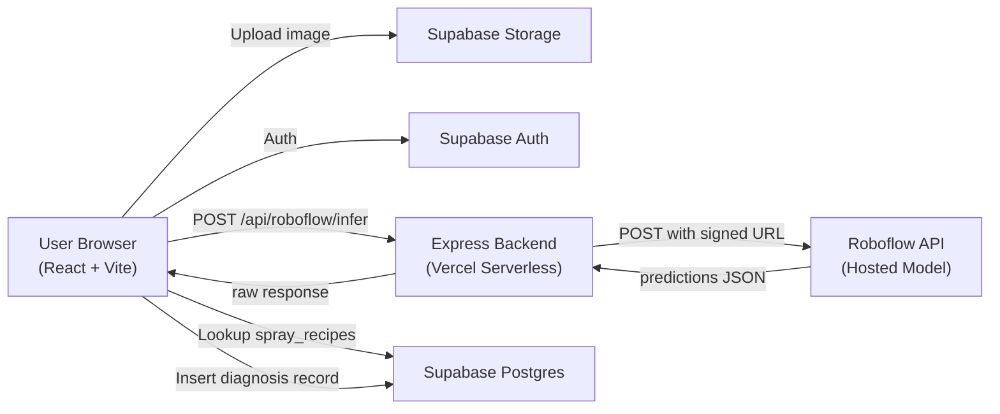

# 🔬 Comprehensive Project Analysis: Intelligent Fertilizer & Pesticide Sprinkling System

## Project Overview

| Attribute | Detail |
|---|---|
| **Stack** | React 18 + TypeScript (Vite) frontend, Express backend, Supabase (Auth + DB + Storage) |
| **ML Backend** | Roboflow hosted inference (no local model) |
| **Models** | `insect-pesticide/1` (pest detection), `fertilizer-sprinkling/2` (disease detection) |
| **Deployment** | Vercel serverless + Supabase cloud |
| **Scope** | Rice crops only (5 pest classes, 6 disease classes + healthy + unlabeled) |

### Architecture Diagram



---

## What the System Actually Does (Step by Step)

1. User signs in via Supabase email auth
2. User uploads a plant image → stored in Supabase Storage
3. A signed URL is generated → sent to the Express backend
4. Backend proxies the image URL to Roboflow's `detect.roboflow.com` API
5. Roboflow returns predictions (class labels + confidence scores)
6. **Frontend** looks up a `spray_recipes` table in Supabase to find the matching recommendation
7. **Frontend** builds a `Decision` object (spray/no-spray, dosage, notes)
8. **Frontend** inserts the diagnosis record into Supabase
9. User sees result + can view history

---

## 🚨 CRITICAL FLAWS (Project Killers)

### 1. 🤖 The ML Model is a Black Box with No Validation

> [!CAUTION]
> This is the single biggest problem. For a pre-final year project, you MUST demonstrate ML competence.

| Problem | Details |
|---|---|
| **No model training code** | The entire ML pipeline is hidden behind Roboflow's hosted API. You have zero training scripts, no Jupyter notebooks, no hyperparameter tuning, no data augmentation pipeline. |
| **No evaluation metrics** | No accuracy, precision, recall, F1-score, confusion matrix, or ROC curves anywhere in the project. |
| **No dataset documentation** | How many images per class? What's the class distribution? Is it balanced? We don't know. |
| **No model architecture choice justification** | What model architecture is Roboflow using? YOLOv5? YOLOv8? Classification or Detection? The project doesn't document this. |
| **Roboflow = someone else's black box** | You can't explain the model during a viva. "We uploaded images to Roboflow and clicked train" is not acceptable for a pre-final year project. |
| **Manual labeling on Roboflow** | You mentioned your friend manually labeled the dataset on Roboflow. There's no annotation quality review, no inter-annotator agreement, no label consistency check. |

### 2. 🔐 API Keys Committed to Git

> [!CAUTION]
> Your `.env` file containing real Supabase keys and Roboflow API key is committed to the repository.

```
VITE_SUPABASE_URL=https://cieuciazavuprajxpzvp.supabase.co
VITE_SUPABASE_ANON_KEY=eyJhbGciOiJIUzI1NiIs...
ROBOFLOW_API_KEY=qsoY2Xn003BKLD8IZ1y4
```

- The `.gitignore` exists but the `.env` was already committed
- **Anyone** with your repo can access your Supabase database and Roboflow account
- **Rotate all keys immediately**

### 3. 🏗️ Decision Logic is Duplicated and Inconsistent

There are **TWO completely different decision engines**, and only one is actually used:

| Location | Version | Used? |
|---|---|---|
| [api/lib/decision.ts](file:///Users/gokxl/Desktop/plant-disease-detector/api/lib/decision.ts) | `v1.0.0` — Simple: if confidence > 0.6, recommend based on model prefix | ❌ **DEAD CODE** |
| [src/pages/Home.tsx](file:///Users/gokxl/Desktop/plant-disease-detector/src/pages/Home.tsx#L26-L92) (`buildDecision`) | `v2.1.0` — Uses spray_recipes from DB, has uncertainty margin logic | ✅ Actually used |

The backend `decide()` function is **never called anywhere**. It has its own tests ([decision.test.ts](file:///Users/gokxl/Desktop/plant-disease-detector/api/lib/decision.test.ts)) but they test dead code. Meanwhile, `buildDecision` in `Home.tsx` (the one actually used) has **zero tests**.

---

## ⚠️ MAJOR FLAWS

### 4. Architecture Problems

| Flaw | Details |
|---|---|
| **Decision logic runs on the client** | `buildDecision()` runs entirely in the browser. A malicious user can manipulate the decision in DevTools. For a "system" that recommends pesticide application, this is a serious design weakness. |
| **No authentication on the API endpoint** | `/api/roboflow/infer` has zero auth checks. Anyone can POST to it and burn your Roboflow API credits. |
| **Dashboard components exist but are NOT used** | 6 polished dashboard components in `src/components/dashboard/` (`UploadCard`, `ModelSelectCard`, `PredictionResultsCard`, `SprayDecisionCard`, `BottomActionBar`, `ProgressBar`) are **never imported by any page**. `Home.tsx` builds everything inline instead. |
| **Prediction normalization is duplicated 3 times** | The same Roboflow prediction parsing logic exists in: `src/lib/roboflow.ts`, `api/lib/decision.ts`, and inline in `src/pages/ResultDetail.tsx` (lines 44-80). |
| **No input validation on image type** | The `accept="image/*"` attribute can be bypassed. There's no server-side validation that the uploaded file is actually an image. |

### 5. Database & Data Model Issues

| Flaw | Details |
|---|---|
| **spray_recipes is world-writable** | The RLS policy allows ANY authenticated user to write/update/delete spray recipes. In a production system, only admins should modify treatment rules. |
| **No spray schedule/period tracking** | Your project description mentions "recommends spraying chemical and period" but there is zero time-period logic. No spray intervals, no "spray every X days", no calendar integration. |
| **No plant/crop tracking** | There's no concept of a specific plant, field, or crop. Each diagnosis is an isolated event. You can't track a plant's health over time because there's no plant ID. |
| **No user roles** | Every user has the same permissions. There's no farmer vs. agronomist vs. admin distinction. |
| **diagnoses stores raw Roboflow JSON** | The `raw_inference JSONB` column stores the entire Roboflow response. While useful for debugging, it couples your database schema to Roboflow's API response format. |

### 6. The "Fertilizer" Model is Misnamed and Misused

Looking at the seed data in [0002_spray_recipes.sql](file:///Users/gokxl/Desktop/plant-disease-detector/supabase/migrations/0002_spray_recipes.sql):

- The model is called `fertilizer-sprinkling/2` but it detects **diseases** (Bacterial Blight, Blast Disease, Brown Spot, etc.)
- All disease classes have `action_type: 'pesticide'` not `'fertilizer'`
- The UI calls it "Disease Model" but the Roboflow model ID says "fertilizer-sprinkling"
- **There is no actual fertilizer recommendation logic anywhere in the system**

> [!WARNING]
> The project title says "Fertilizer and Pesticide Sprinkling System" but it has zero fertilizer functionality. This will be questioned during evaluation.

### 7. Missing Features for Pre-Final Year Standards

| Missing Feature | Why It Matters |
|---|---|
| **No data visualization / analytics dashboard** | No charts showing disease trends, pest frequency over time, spray history analytics |
| **No report generation** | No PDF/printable reports for farmers |
| **No IoT integration or simulation** | Title says "Sprinkling System" — there's no sprinkler control, no IoT simulation, not even a mock API for hardware |
| **No crop-specific recommendations** | Same generic "Follow label instructions" for every pest/disease |
| **No weather integration** | Spray effectiveness depends heavily on weather. No weather data consideration |
| **No notification system** | No alerts when disease is detected, no email/push notifications |
| **No multi-language support** | For Indian farmers, local language support is essential |
| **Settings page is empty** | Just shows the email address. No actual settings to configure |
| **No mobile responsiveness on sidebar** | `AppShell` sidebar is `hidden md:block` — on mobile there's no navigation at all |

---

## 📊 Code Quality Assessment

### What's Actually Good

- ✅ Clean TypeScript throughout (no `any` abuse)
- ✅ Supabase RLS policies are well-structured for user data isolation
- ✅ Glassmorphism UI design system is consistent and polished
- ✅ Dark mode support works properly
- ✅ Proper error handling in the API route (validates modelId, imageUrl)
- ✅ Vercel deployment config is correct
- ✅ Proxy setup in Vite config for local development works well
- ✅ The `spray_recipes` concept (configurable rules per class) is a good idea

### Dead / Unused Code

| File | Status |
|---|---|
| `api/lib/decision.ts` | Dead code — never called by any route |
| `api/lib/decision.test.ts` | Tests dead code |
| `src/components/dashboard/*.tsx` (6 files) | Never imported anywhere |
| `src/lib/dashboardFormat.ts` | Only used by unused dashboard components |
| `src/components/Empty.tsx` | Never imported |

---

## 🎯 Priority Action Plan: What You Should Do

### Phase 1: IMMEDIATE (Fix Project-Killing Issues) — 1-2 weeks

#### 1.1 Train Your Own Model Locally
This is non-negotiable for a pre-final year project:

```
Option A (Recommended): PyTorch + Transfer Learning
- Use MobileNetV2 or ResNet50 pretrained on ImageNet
- Fine-tune on your labeled dataset (~10-15 crop disease classes)
- Use a standard public dataset (PlantVillage has 50,000+ images, 38 classes)
- Supplement with your Roboflow-labeled rice images
- Document: accuracy, confusion matrix, F1-score, training curves

Option B: Keep Roboflow but add self-trained comparison
- Export your Roboflow dataset (you can download it)
- Train locally with YOLOv8 or a classifier
- Show comparison: "Roboflow hosted vs. self-trained" in your report
```

#### 1.2 Rotate All Secrets
- Generate new Supabase anon key
- Generate new Roboflow API key
- Ensure `.env` is in `.gitignore` and remove it from git history

#### 1.3 Move Decision Logic Server-Side
- Move `buildDecision()` from `Home.tsx` to the Express backend
- The `/api/roboflow/infer` endpoint should return the **decision**, not just raw predictions
- Delete the dead `api/lib/decision.ts` or merge it with the real logic

### Phase 2: MEDIUM-TERM (Add Academic Substance) — 2-3 weeks

#### 2.1 Add Plant/Crop Tracking
```sql
-- New table
CREATE TABLE plants (
  id UUID PRIMARY KEY,
  user_id UUID NOT NULL,
  name TEXT NOT NULL,          -- "Field A - Plot 3"
  crop_type TEXT NOT NULL,     -- "rice", "wheat"
  planted_date DATE,
  location TEXT,               -- GPS or text
  created_at TIMESTAMPTZ DEFAULT NOW()
);

-- Link diagnoses to a plant
ALTER TABLE diagnoses ADD COLUMN plant_id UUID REFERENCES plants(id);
```

#### 2.2 Add Spray Schedule/Period Logic
- After a diagnosis recommends spraying, create a spray schedule
- "Spray Imidacloprid every 7 days for 3 applications"
- Track spray history per plant

#### 2.3 Add Analytics Dashboard
- Disease frequency chart (bar chart: which diseases are most common)
- Confidence distribution chart
- Spray history timeline per plant
- Use a charting library (recharts, chart.js)

#### 2.4 Add Real Fertilizer Logic
- If crop shows nutrient deficiency symptoms (yellowing, stunted growth), recommend NPK ratios
- This justifies the "Fertilizer" in your project title

### Phase 3: POLISH (Differentiate Your Project) — 1-2 weeks

#### 3.1 IoT Simulation Layer
- Add a mock sprinkler control API endpoint
- Show a UI for "sprinkler status: ON/OFF"
- Even if hardware isn't connected, simulate the pipeline

#### 3.2 Report Generation
- Generate a PDF diagnosis report per plant
- Include image, diagnosis, recommendation, spray schedule

#### 3.3 Weather Integration
- Use a free weather API (OpenWeatherMap)
- Show "spray not recommended today due to rain forecast"

---

## 🧭 Summary: Current Project Grade Assessment

| Category | Current State | Target |
|---|---|---|
| **ML/AI** | ❌ Black-box Roboflow, no metrics | Self-trained model with documented evaluation |
| **Architecture** | ⚠️ Works but messy, dead code, logic in wrong places | Clean server-side decision engine |
| **Security** | ❌ Keys exposed, no API auth | Secrets rotated, API authenticated |
| **Features** | ⚠️ Basic upload-predict-store loop | Plant tracking, spray schedules, analytics |
| **Academic Value** | ❌ Can't explain model during viva | Training code, confusion matrix, comparison study |
| **Documentation** | ⚠️ README covers setup only | Architecture doc, data flow diagram, evaluation report |
| **Testing** | ❌ Tests exist for dead code only | Tests for actual decision logic + integration tests |

> [!IMPORTANT]
> **The #1 thing you must do is train your own model.** Everything else can be explained away during a presentation, but if the evaluator asks "show me your training code and accuracy metrics" and you have nothing, that's a fail for a pre-final year ML project.

The web app shell is solid — the UI, auth, storage, and database design are good foundations. The problem is that the **core intelligence** (the ML model and decision engine) is outsourced and hollow. Fix that, and you have a project worth presenting.
